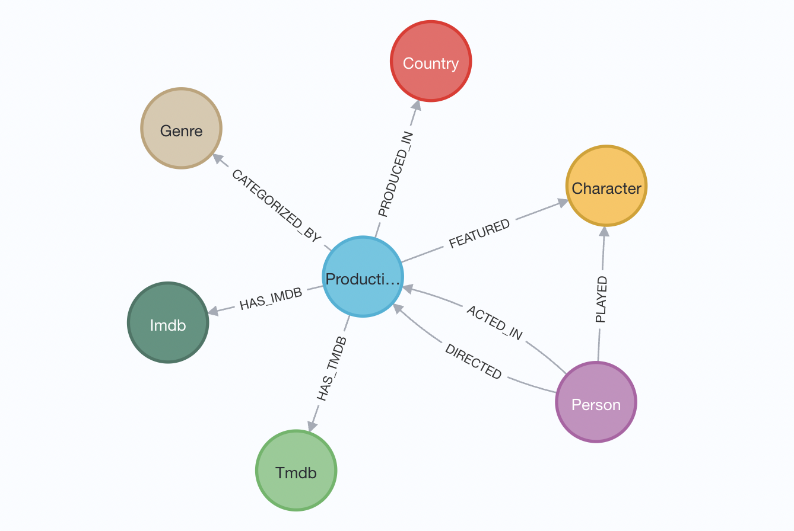

= Neo4j Person Service with Kaggle Netflix Data Set

This project is a sample service for interacting with person data (actors, directors, characters, etc) stored in a Neo4j graph database. Technologies used include the following:

* Spring Boot
* Neo4j
* Kaggle Netflix data set

== Data set

Data is maintained and pulled from a publicly-available https://www.kaggle.com/datasets/victorsoeiro/netflix-tv-shows-and-movies[Kaggle data set^].
It contains movies and tv shows, as well as persons involved and the roles each played. The data is organized into two CSV files, and we also complemented it with a Wikipedia country name CSV file provided by https://gist.github.com/radcliff[radcliff^] in a https://gist.github.com/radcliff/f09c0f88344a7fcef373[Github repository^] to map the provided two-letter country codes to full country names.

An example of the Neo4j data model is shown below.

== Presentation

PDF versions of accompanying presentations are published to SpeakerDeck.

* https://speakerdeck.com/jmhreif/delegate-automate-dominate-putting-graph-tech-to-work-for-you-to-unlock-hidden-insights-and-opportunities[GraphConnect 2022^]

== Resources
* https://dev.neo4j.com/aura[Neo4j AuraDB (FREE instance)^]
* https://bit.ly/aura-docs[Neo4j Aura documentation^]
* https://bit.ly/sdn-docs[Spring Data Neo4j documentation^]